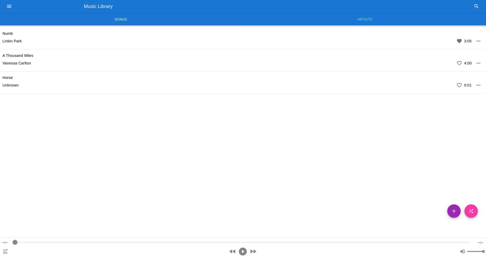

# Lit Music

    
    

A music player that is lit.

## How to setup backend

Follow the [README](./Edge.LitMusic/README.md) in `Edge.LitMusic` directory.

## How to setup frontend

Follow the [README](./Web.LitMusic/README.md) in `Web.LitMusic` directory.
