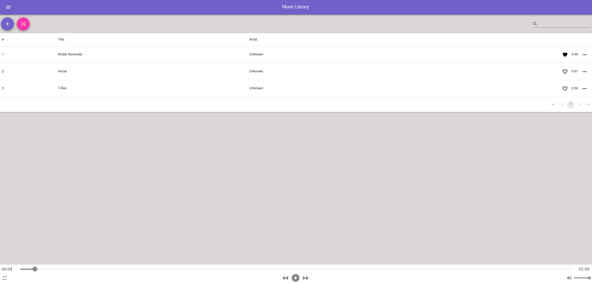

# MyMusic


Your go-to platform for playing and effortlessly managing all your favorite tunes in one centralized space.



## Prerequisites

1. [Node.js](https://nodejs.org/en/) (v18)
2. [.NET Core](https://dotnet.microsoft.com/en-us/download) (v8)
3. [Make](https://www.gnu.org/software/make/)

## Usage

To run MyMusic on your local machine, execute the following command:

```bash
# web
$ make web

# server
$ make server
```

To run MyMusic in production mode, execute the following command:

```bash
$ make up
```

## Further Details

For a deeper dive into either the backend or frontend aspects, refer to the README files in the following repositories:

-   Explore the [README](./Edge.MyMusic/README.md) in `Edge.MyMusic` for backend insights.
-   Refer to the [README](./Web.MyMusic/README.md) in `Web.MyMusic` for frontend specifics.
